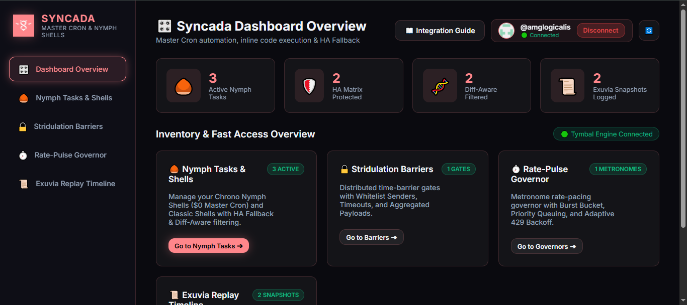

<div align="center">


# ⏰ SYNCADA v1.0.0
### Master Cron, Task Automation & Nymph Shells Engine ($0 Infrastructure)

[](LICENSE)
[](package.json)
[]()
[]()
[](https://amglogicalis.github.io/syncada-repo-public/)

**[🌐 Open Live Web Console](https://amglogicalis.github.io/syncada-repo-public/)** • **[📦 NPM Package](https://www.npmjs.com/package/terra-syncada)**

---

</div>

## 📸 Syncada Tymbal Studio — Web Console Preview

Access the live, glassmorphic Web Console directly from your browser to visually manage, edit, trigger, and debug all your automated tasks, barriers, and rate governors.

[](https://amglogicalis.github.io/syncada-repo-public/)

> 🔗 **Try it Live**: **[https://amglogicalis.github.io/syncada-repo-public/](https://amglogicalis.github.io/syncada-repo-public/)**

---

## 💡 What is Syncada?

**Syncada** is the 11th Titan of the **Terra Ecosystem** — a 100% free, standalone **Master Cron, Task Automation & Nymph Shells Engine** inspired by the biological periodicity and stridulation of **Cicadas (Cigarras)**.

With Syncada, you can schedule and automate any workflow, serverless script, or HTTP webhook with **High-Availability (HA) Fallback Matrix (1-5 retries)**, **Diff-Aware Smart Emergence**, **Distributed Time-Barriers**, **Rate-Limit Metronome Governors**, and **1-Click Forensic Time-Travel Replays** — all running on $0-cost GitHub infrastructure with **zero third-party dependencies**.

---

## 🌟 The 4 Core Technologies Explained

### 1. 🌰 Syncada Nymph Shells & Chrono-Automation
- **Serverless Code Runlets ($0 Cost)**: Write custom inline JavaScript/TypeScript code snippets directly inside your tasks. Executed safely in an isolated VM sandbox inside $0-cost GitHub Actions runners or local runtime without deploying external servers or paid Lambdas.
- **🛡️ HA Fallback Matrix**: Automatically retries primary targets up to 3 times (configurable 1-5 retries). If all retries fail, seamlessly triggers your **Secondary Fallback Target** (HTTP URL or fallback JS code).
- **🔔 Multi-Channel Alerts**: Direct alert notifications via **Webhook** (Discord, Slack, Custom HTTP) or native **GitHub Issue creation** without third-party libraries.
- **🧬 Diff-Aware Smart Emergence**: Hashes task output responses with SHA-256. If data hasn't changed since the previous emergence run, marks execution as `SKIPPED_NO_DIFF ⚪` to avoid sending duplicate alert notifications.
- **💤 Hibernation Circuit Breaker**: Automatically suspends tasks after 3 consecutive failures to prevent infinite failing loops.

### 2. 🔒 Stridulation Barrier Sync (Distributed Time Gates)
- Holds execution until $N$ independent microservices, CI/CD pipelines, or scripts send their signal (`syncada.barrier.signalBarrier(barrier, 'auth-service')`).
- Releases the gate automatically when the required threshold or sender whitelist checks in.
- Supports sender whitelisting, timeout policies (`auto_abort` / `auto_release`), and custom HTTP targets triggered upon release.

### 3. ⏱️ Temporal Rate-Pulse Governor (Metronome Pacing & Priority Queue)
- High-throughput queue metronome that throttles batch task executions (e.g., 1 request per 2.5 seconds), shielding your applications from HTTP 429 Rate Limit bans (OpenAI, Anthropic, payment gateways).
- **Priority Queueing**: Automatically sorts enqueued payloads into `🔴 HIGH` (weight 3), `🟡 NORMAL` (weight 2), and `🟢 LOW` (weight 1) priority buckets, ensuring critical requests jump to the front of the queue.
- **Adaptive 429 Backoff**: Dynamically increases cadence delay if an external target returns HTTP 429, easing load until servers recover.

### 4. 📜 Exuvia Time-Travel Snapshot & Replay Engine
- Generates immutable execution receipts (Exuvia snapshots) for every run, storing execution duration, HTTP status, output hash, failover usage, and execution logs.
- **1-Click Forensic Replay (`syncada replay <exuviaId>`)**: Re-executes any past historical run from days ago in an isolated sandbox to debug errors, verify hash consistency, or re-trigger downstream actions.

---

## 🎛️ Integration & Usage via Web Console

The **Syncada Tymbal Studio** web console (`#ff868b` primary palette) allows zero-code management directly in your browser:

1. **Connect GitHub PAT**: Paste your GitHub Personal Access Token (`repo` scope) in the topbar to automatically load and persist your `.syncada-storage` state.
2. **Create / Edit Nymph Tasks**: Click **`➕ New Task`** or **`✏️ Edit`** on any task card. Customize task name, schedule (cron expression), primary target (Inline JS code or HTTP URL), HA retries (1-5), secondary fallback target, diff-aware toggle, and webhook alert URLs.
3. **Control Rate Governors**: Enqueue payloads into governors via the **`📥 Push Payload`** modal, set payload priorities (`HIGH`, `NORMAL`, `LOW`), toggle **Auto-Pulse ON/OFF**, or trigger manual metronome pulses.
4. **Manage Barrier Gates**: Monitor required signal counts, inspect whitelist senders, and manually signal or edit barrier policies.
5. **1-Click Integration Snippets**: Click **`📋 Integration Snippets`** on any card to view and copy pre-filled integration code snippets for Node.js/TS SDK, Python, cURL, and CLI commands.

---

## 💻 CLI Integration & Command Reference

Install Syncada globally or run via `npx`:

```bash
# Install globally via NPM
npm install -g terra-syncada

# Launch local Web Console Studio
syncada studio --port 3723
```

### Command Directory

```bash
# 🌰 NYMPH TASKS
syncada task list                                       # List all registered tasks in NymphVault
syncada task add "Database Backup" --schedule "0 0 * * *" --url "https://api.mycompany.com/backup" --ha --retries 3 --diff
syncada task edit <id> --name "New Task Name" --schedule "*/15 * * * *"
syncada task delete <id>                                # Delete task from NymphVault
syncada task run <taskId>                               # Trigger task emergence on-demand

# ⚡ INSTANT SERVERLESS RUNLET
syncada lambda run "return { status: 'OK', time: new Date().toISOString() };"

# 🔒 STRIDULATION BARRIERS
syncada barrier list                                    # List all barrier gates
syncada barrier create "Deploy Gate" --key "gate-prod" --count 2 --senders "auth,billing" --timeout 60000
syncada barrier edit <id> --name "Updated Gate Name" --count 3
syncada barrier signal "gate-prod" --sender "auth" --payload '{"status":"READY"}'
syncada barrier delete <id>                             # Delete barrier gate

# ⏱️ RATE-PULSE GOVERNORS
syncada governor list                                   # List all rate governors
syncada governor create "OpenAI Metronome" --cadence 2500 --url "https://api.openai.com/v1/embeddings" --burst 2
syncada governor edit <id> --cadence 1500 --burst 5
syncada governor toggle-auto <id>                       # Toggle background Auto-Pulse ON/OFF
syncada governor push <govId> --payload '{"input":"Urgent prompt"}' --priority high
syncada governor pulse <govId>                          # Trigger a manual metronome burst
syncada governor delete <id>                            # Delete rate governor

# 📜 EXUVIA TIME-TRAVEL REPLAY
syncada exuvia list                                     # List all execution receipts
syncada replay <exuviaId>                               # 1-Click Forensic Time-Travel Replay
```

---

## 📦 SDK Programmatic Integration Guide

Integrate Syncada into your Node.js or TypeScript applications:

```typescript
import { Syncada } from 'terra-syncada';

// 1. Initialize Syncada Engine
const syncada = new Syncada({ githubToken: process.env.GITHUB_TOKEN });
await syncada.init();

// 2. Create a Chrono Nymph Task with HA Fallback & Inline Code Runlet
const task = syncada.createTask({
  name: 'Crypto Price Monitor',
  schedule: '*/15 * * * *',
  primaryTarget: {
    type: 'inline_code',
    inlineCode: 'const res = await fetch("https://api.coindesk.com/v1/bpi/currentprice.json"); const data = await res.json(); return { rate: data.bpi.USD.rate };'
  },
  enableHA: true,
  maxRetries: 3,
  fallbackTarget: {
    type: 'http',
    url: 'https://backup-api.mycompany.com/crypto'
  },
  enableDiffAware: true,
  alerts: {
    notifyOnSuccess: true,
    webhookUrl: 'https://discord.com/api/webhooks/...'
  }
});

// 3. Trigger Task Emergence
const { task: updatedTask, snapshot } = await syncada.runTask(task.id);
console.log(`Emergence Completed in ${snapshot.durationMs}ms:`, snapshot.outputSnippet);

// 4. Enqueue High-Priority Payload into Rate Governor
const gov = syncada.listGovernors()[0];
syncada.governor.pushPayload(gov, {
  input: "Translate customer urgent review"
}, { priority: 'high' });

// 5. Signal a Stridulation Barrier Gate
await syncada.barrier.signalBarrier('gate-prod-deploy', 'auth-service', { status: 'READY' });
```

---

## ⚙️ Configuration Parameters Reference

| Parameter | Type | Description | Default |
| :--- | :--- | :--- | :--- |
| `name` | `string` | Display name of the Task, Barrier, or Governor | **Required** |
| `schedule` | `string` | Cron expression (e.g. `*/15 * * * *`, `0 9 * * *`) | `On-Demand` |
| `primaryTarget` | `Object` | Target destination (`inline_code` or `http` URL) | **Required** |
| `enableHA` | `boolean` | Enable High Availability Retry & Failover Matrix | `true` |
| `maxRetries` | `number` | Maximum retry attempts before triggering failover (1-5) | `3` |
| `fallbackTarget` | `Object` | Secondary destination triggered if primary fails | `undefined` |
| `enableDiffAware` | `boolean` | SHA-256 Hash filtering to skip duplicate notifications | `true` |
| `alerts.webhookUrl` | `string` | Webhook URL for Discord, Slack, or custom HTTP alerts | `undefined` |
| `alerts.issueRepo` | `string` | GitHub repository (`owner/repo`) for alert issue creation | `undefined` |
| `cadenceMs` | `number` | Rate governor metronome pulse interval in milliseconds | `2500` |
| `maxBurst` | `number` | Number of items processed per governor metronome pulse | `1` |
| `priority` | `string` | Queue priority bucket (`high`, `normal`, `low`) | `normal` |
| `requiredSenders` | `Array` | Whitelist of sender IDs required to release a Barrier gate | `[]` |
| `timeoutMs` | `number` | Timeout in ms after which barrier auto-aborts or releases | `undefined` |

---

## 📜 License

MIT © [amglogicalis](https://github.com/amglogicalis) • Built for the **Terra Ecosystem** ($0 Infrastructure)
